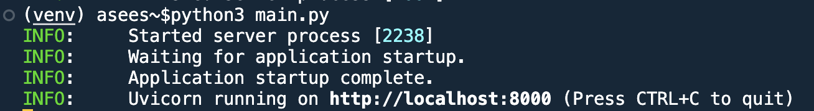
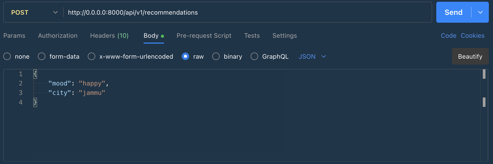
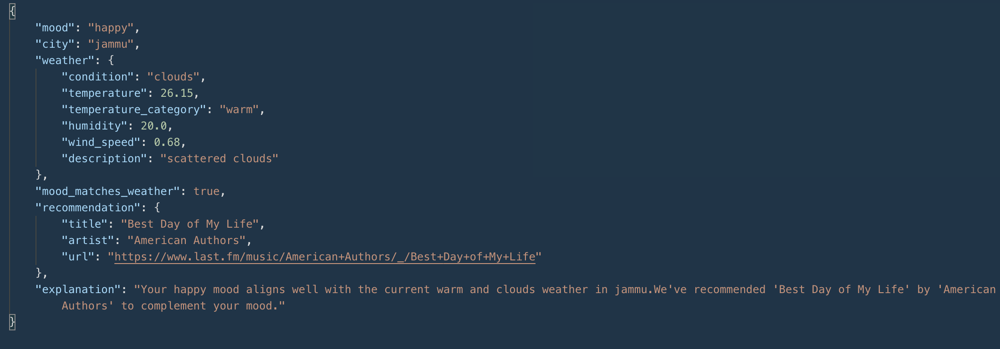
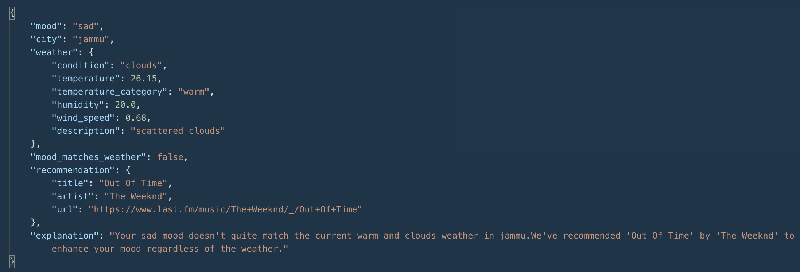
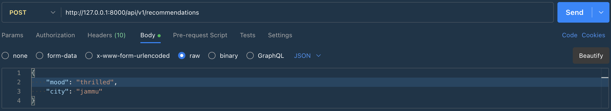
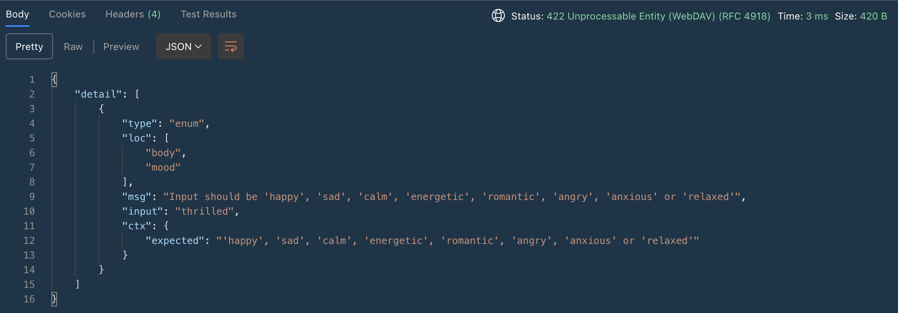
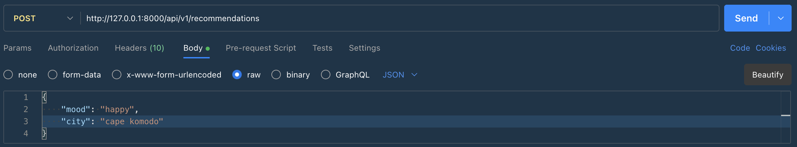
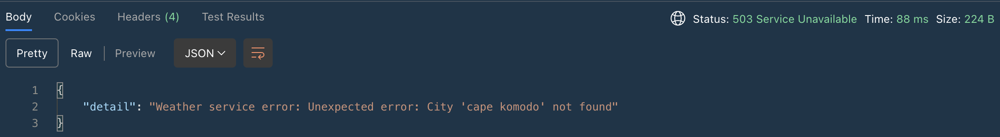

# Mood-Weather-Music API

This application provides song recommendations based on a user's mood and weather in their city. The system takes a user's mood and city as input, checks if the mood matches the current weather in that city, and recommends a song that complements the user's mood.

## Features

- Accepts user's current mood and city as input
- Retrieves current weather data for the specified city
- Determines if the user's mood matches the current weather
- Recommends a song that matches the user's mood
- Provides detailed explanation of the mood-weather relationship

## Architecture

The application follows a clean architecture approach with the following components:

1. **API Layer**: Handles HTTP requests and responses using FastAPI
2. **Service Layer**: Contains the business logic for mood matching, weather data retrieval, and song recommendations
3. **Model Layer**: Defines the data structures used throughout the application

## Technologies Used

- **Python 3.12**: Programming language
- **FastAPI**: Web framework for building APIs
- **Pydantic**: Data validation and settings management
- **httpx**: HTTP client for making API requests
- **pytest**: Testing framework

## External APIs

- **[OpenWeatherMap API](https://openweathermap.org/api)**: Used to fetch current weather data for a city
- **[Last.fm API](https://www.last.fm/api)**: Used to get song recommendations based on mood tags.

## Getting Started

### Prerequisites

- Python 3.12
- API keys for OpenWeatherMap and Last.fm


### Note: Before proceeding ahead, make sure you are inside the directory `Mood-Weather-Music`

### Environment Variables

Create a `.env` file in the root directory with the following variables:
- OPENWEATHER_API_KEY=XXXXXXXXXXX
- LASTFM_API_KEY=XXXXXXXXXXX

### Virtual Environment

Create a virtual environment using:
- ```python3 -m venv venv```

Activate the virtual environment using:
- ```source venv/bin/activate``` if using linux/mac
- ```venv\Scripts\activate``` if using windows

### Installing dependencies

Install the dependencies using:
- ```pip install -r requirenments.txt```

### Start Application
Start the application using:
- ```python3 main.py``` in using linux/mac
- ```python main.py``` in using windows

   

   If you see the above response, you successfully started the application.

### Various Test cases with inputs and outputs using postman:

1. Valid Mood and City name with mood matched with weather:
- Input: 
- Output(Status code:200): 

2. Valid Mood and City name with mood not matched with weather:
- Input: 
- Output(Status code:200): 

3. Invalid Mood and Valid City name:
- Input: 
- Output(Status code:422): 

4. Valid Mood and Invalid City name:
- Input: 
- Output(Status code:503): 

## **Project Structure**

```
MOOD-WEATHER-MUSIC/
│── README.md # About the project
│── main.py # This module starts the application
│── app/
│   ├── __init__.py
│   ├── api/ # Stores the endpoints
│   │   ├── __init__.py
│   │   ├── endpoints.py
│   ├── error/ # Custom exceptions
│   │   ├── exceptions.py
│   │   ├── models.py
│   ├── services/ # Various services
│   │   ├── __init__.py
│   │   ├── explanation/ # Generate a human-readable explanation of the mood-weather match
│   │   │   ├── music_explanation.py
│   │   ├── mood/ # Determine if the user's mood matches the current weather conditions
│   │   │   ├── models.py
│   │   │   ├── mood_service.py
│   │   ├── music/ # Get a song recommendation based on the user's mood using the Last.fm API
│   │   │   ├── config.py
│   │   │   ├── models.py
│   │   │   ├── music_service.py
│   │   ├── weather/ # Retrieve current weather data for a specified city
│   │   │   ├── config.py
│   │   │   ├── models.py
│   │   │   ├── weather_service.py
│── assets/ # Stores the Screenshots for the purpose of README.md
│   ├── image_1.png
│   ├── image_2.png
│   ├── image_3.png
│   ├── image_4.png
│   ├── image_5.png
│   ├── image_6.png
│   ├── image_7.png
│   ├── image_8.png
│   ├── image_9.png
│   ├── image_10.png
│── tests/ # Test Cases
│   ├── __init__.py
│   ├── test_endpoints.py
│   ├── test_mood_service.py
│   ├── test_music_service.py
│   ├── test_weather_service.py
```


